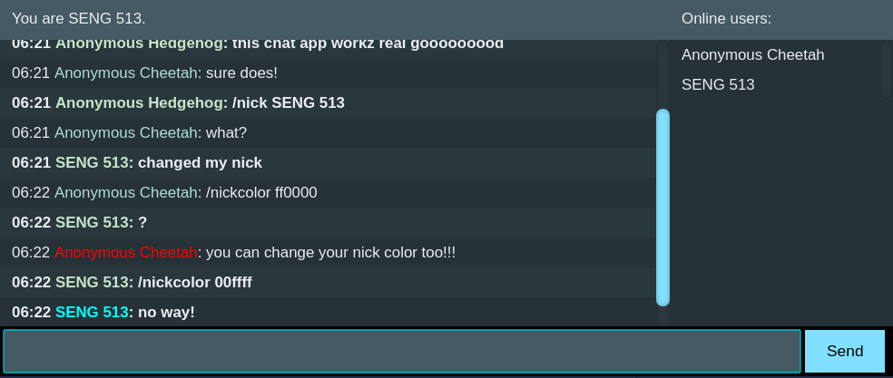

# SENG 533 - Assignment 3

## Instructions

### Start Server

To run the server, navigate the directory containing this README file and run:

`node install`

`node start`

### Load Chat Client

To access a chat client, open a browser and navigate to:

`http://localhost:51900`

### Note

Since this application uses cookies, you will need to use different browsers to chat. Supported browsers:

- Google Chrome 63.0.3239.132 (Official Build) (64-bit)
- Firefox 57.0.4 (64-bit)
- Vivaldi 1.13.1008.40